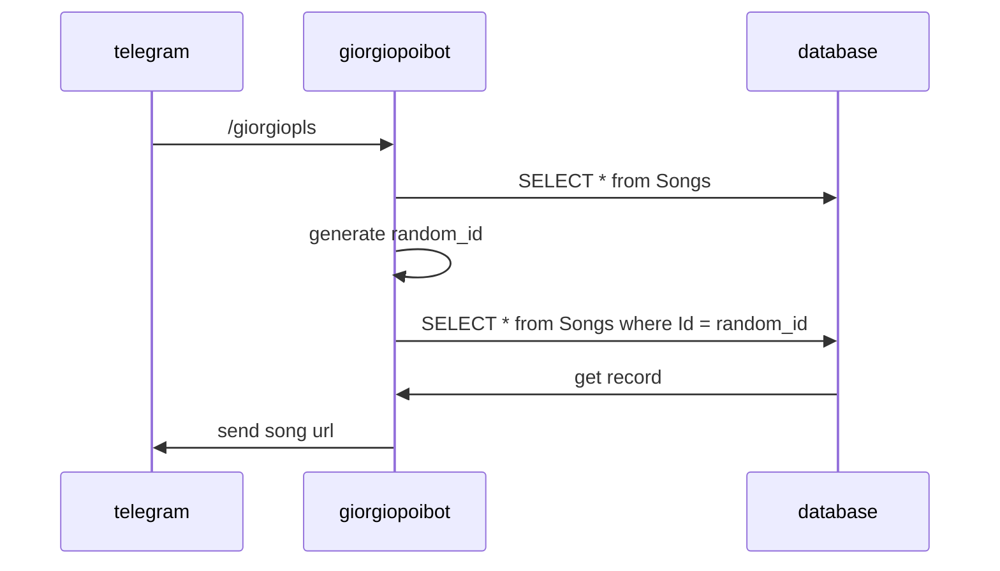

# giorgiopoibot

È un semplicissimo bot telegram che restituisce in modo pseudorandomico canzoni del cantante indie [Giorgio Poi](https://it.wikipedia.org/wiki/Giorgio_Poi). Nasce come parte di un regalo di Natale e, per i vincoli imposti da questa <del>imminente</del> deadline, mantiene una struttura elementare.
## Giorgiopoibot: diagramma di sequenza

## to-do:
* ~~Renderlo scalabile (appoggiarsi alle API di youtube?)~~: fatto
